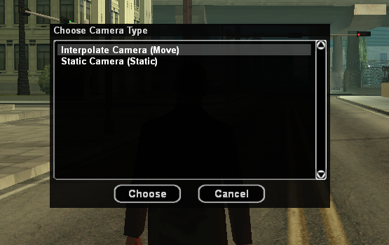
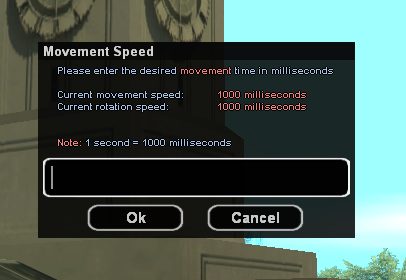
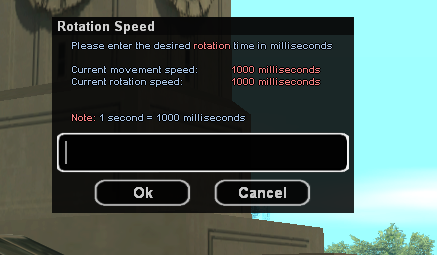

# CamEditor for open.mp

In-game camera movement editor for open.mp servers. Create smooth camera interpolations and static camera views without manually typing coordinates.

**Original by Drebin | Modified for open.mp**

## Installation

1. **Download the script**
```bash
git clone https://github.com/yourusername/CamEditor-openmp.git
```

2. **Place in filterscripts folder**
```
YourServer/
└── filterscripts/
    └── CamEditor.pwn
```

3. **Compile**
```bash
pawncc CamEditor.pwn -; -(
```

4. **Add to server.cfg**
```ini
filterscripts CamEditor
```

5. **Restart server**

## Commands

| Command | Description |
|---------|-------------|
| `/cameditor` | Open camera editor |
| `/closecameditor` | Exit camera editor |

## Usage

### Creating Interpolate Camera (Moving)

1. **Start editor**
   ```
   /cameditor
   ```
   

2. **Choose mode**
   - Select "Interpolate Camera (Move)"

3. **Set start position**
   - Use **W, A, S, D** to fly around
   - Use **Mouse** to look around
   - Press **LMB (Left Click)** to save start position

4. **Set end position**
   - Fly to where you want camera to end
   - Press **LMB** to save end position

5. **Configure speeds**
   - Enter movement speed (milliseconds)

   

   - Enter rotation speed (milliseconds)

   

   - *Recommended: 10000-20000ms for smooth intros*

6. **Preview & Save**
   - Choose "Preview" to test
   - Choose "Save" to export code
   - Enter a name (e.g., "loginview")

### Creating Static Camera (Fixed)

1. **Start editor**
   ```
   /cameditor
   ```
   

2. **Choose mode**
   - Select "Static Camera (Static)"

3. **Position camera**
   - Fly to desired location
   - Press **LMB** once to save

4. **Save**
   - Enter a name
   - Code will be exported

## Controls

| Key | Action |
|-----|--------|
| **W** | Move forward |
| **S** | Move backward |
| **A** | Move left |
| **D** | Move right |
| **Mouse** | Look around |
| **LMB** | Save position |

## Output

Generated files are saved in `scriptfiles/` folder:

### Interpolate Camera Output
```pawn
// File: scriptfiles/CamEdit_loginview.txt
|----------loginview----------|
InterpolateCameraPos(playerid, 1382.659912, -831.756774, 71.809570, 1448.835449, -852.254699, 58.609481, 15000);
InterpolateCameraLookAt(playerid, 1386.337280, -828.521911, 72.815933, 1446.238525, -848.345764, 60.334640, 15000);
```

### Static Camera Output
```pawn
// File: scriptfiles/CamEdit_staticview.txt
|----------staticview----------|
SetPlayerCameraPos(playerid, 1382.659912, -831.756774, 71.809570);
SetPlayerCameraLookAt(playerid, 1386.337280, -828.521911, 72.815933);
```

## Implementation

### Login Screen Example
```pawn
function OnUserCheck(const playerid)
{
    // Setup spawn
    SetSpawnInfo(playerid, NO_TEAM, 0, 1427.77, -874.34, 50.63, 348.14, 0, 0, 0, 0, 0, 0);
    SpawnPlayer(playerid);
    
    // Apply camera movement (paste from generated file)
    InterpolateCameraPos(playerid, 1382.66, -831.76, 71.81, 1448.84, -852.25, 58.61, 15000);
    InterpolateCameraLookAt(playerid, 1386.34, -828.52, 72.82, 1446.24, -848.35, 60.33, 15000);
    
    // Show dialog
    Dialog_Show(playerid, DIALOG_LOGIN, DIALOG_STYLE_PASSWORD, "Login", "Enter password:", "Login", "Quit");
    
    return 1;
}
```

### Static Camera Example
```pawn
function ShowStaticView(const playerid)
{
    SetPlayerCameraPos(playerid, 1544.0, -1353.0, 100.0);
    SetPlayerCameraLookAt(playerid, 1544.0, -1353.0, 10.0);
    
    return 1;
}
```

## Menu Options

After setting positions, you'll see a menu with:

| Option | Description |
|--------|-------------|
| **Preview** | Test camera movement |
| **Change Start** | Reposition start point |
| **Change End** | Reposition end point |
| **Change Speed** | Adjust timing |
| **Save** | Export to file |

## Speed Guide

### Movement Speed
- **3000-5000ms** - Quick transitions
- **10000-15000ms** - Smooth showcase (recommended)
- **20000-30000ms** - Cinematic intro

### Rotation Speed
Usually match with movement speed for synchronized movement.

## Common Use Cases

### Login Screen
```pawn
// Slow pan around city - 20 seconds
InterpolateCameraPos(playerid, x1, y1, z1, x2, y2, z2, 20000);
InterpolateCameraLookAt(playerid, lx1, ly1, lz1, lx2, ly2, lz2, 20000);
```

### Character Creation
```pawn
// Circle around character - 10 seconds
InterpolateCameraPos(playerid, x1, y1, z1, x2, y2, z2, 10000);
InterpolateCameraLookAt(playerid, charX, charY, charZ, charX, charY, charZ, 10000);
```

### Spawn Animation
```pawn
// Descend from sky - 8 seconds
InterpolateCameraPos(playerid, x, y, 200.0, x, y, 10.0, 8000);
InterpolateCameraLookAt(playerid, x, y, 0.0, x, y, 0.0, 8000);
SetTimerEx("CompleteSpawn", 8000, false, "d", playerid);
```

## Requirements

- open.mp server
- PAWN Compiler

## Troubleshooting

### Camera moves too fast
- Increase the speed value (higher = slower)
- Recommended: 10000-20000ms

### Can't see the path
- Make sure you spawned the player first with `SpawnPlayer(playerid)`
- Check that camera coordinates are valid

### Filterscript not loading
- Verify it's compiled (`.amx` file exists)
- Check `config.json` has correct filterscript name
- Look for compile errors in `server_log.txt`

### Editor won't close
- Use `/closecameditor` command
- Or restart server if stuck

## API Reference

### Functions Used

```pawn
InterpolateCameraPos(playerid, Float:FromX, Float:FromY, Float:FromZ, Float:ToX, Float:ToY, Float:ToZ, time)
```
Smoothly moves camera from one position to another.

```pawn
InterpolateCameraLookAt(playerid, Float:FromX, Float:FromY, Float:FromZ, Float:ToX, Float:ToY, Float:ToZ, time)
```
Smoothly rotates camera to look from one point to another.

```pawn
SetPlayerCameraPos(playerid, Float:x, Float:y, Float:z)
```
Sets static camera position.

```pawn
SetPlayerCameraLookAt(playerid, Float:x, Float:y, Float:z)
```
Sets static camera look direction.

## Credits

- **Original Author:** Drebin
- **Modified for:** open.mp
- **open.mp Team:** For the open.mp framework

## License

Free to use and modify for your open.mp server & and big thank to Drbein. 

## Support

- **Issues:** [GitHub Issues](https://github.com/eimanns/CamEditor-openmp/issues)
- **open.mp Forum:** [forum.open.mp](https://forum.open.mp)

---

**Made for open.mp servers** 🎮

---
